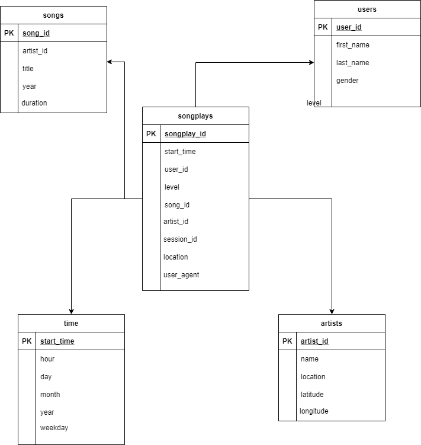

## Introduction
A startup called Sparkify has been collecting data on songs and user activity in JSON format. They are interested in efficiently performing 
song play analysis. Specifically, they want to know which songs do users prefer.

## About the Source Data
The dataset has been gathered from [Million Songs Dataset](https://labrosa.ee.columbia.edu/millionsong/) and logs simulated using 
[event simulator](https://github.com/Interana/eventsim)

## Project Description

The goal of the project is to design a database schema and implement an ETL pipeline that would optimize queries for song play analysis.

## Database Design


This is called a star schema, which is the industry standard for optimizing the desired queries. The table at the center is the *Fact* table 
(songplays) which contains the foreign keys to the *four dimension* tables. Through this design analytical queries such as the following are easy
to execute using simple joins.

~~~~sql
SELECT first_name, last_name, COUNT(*) AS counts 
FROM (songplays LEFT JOIN time ON songplays.start_time = time.start_time)
    LEFT JOIN users ON songplays.user_id = users.user_id 
GROUP BY first_name, last_name, weekday 
HAVING time.weekday='Friday' 
ORDER BY counts DESC LIMIT 5;
~~~~

This query would return the top 5 active users on Fridays.

## ETL 
The following steps are performed to transform the raw songs and logs JSON and save in Postgres
1. `create_tables.py` script creates any table as listed in the previous step if it does not exist and also the `sparkifydb` database
2. `etl.py` script extracts the necessary attributes from songs or logs json files and then invokes `sql_queries.py` to save data in Postgres

## Usage

The execute the project run
```python
python create_tables.py
python etl.py
```

**Note: It is necessary to execute the create_tables script before etl as that creates the database and tables.**
